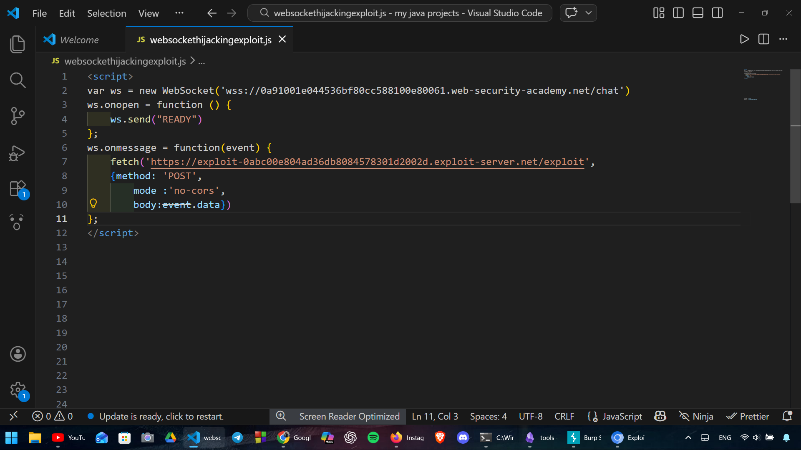
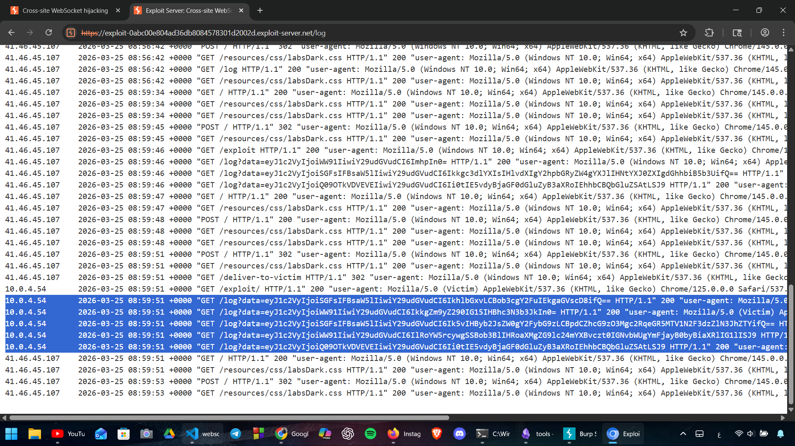
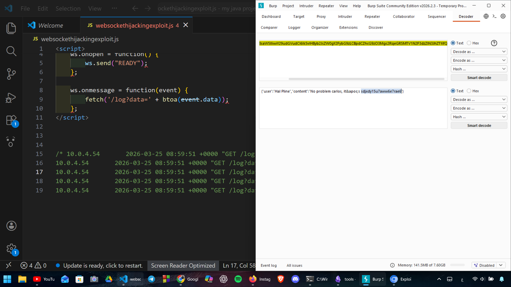

# Lab: Cross-site WebSocket hijacking

## Overview
Exfiltrating victim chat history by exploiting a vulnerable WebSocket handshake that lacks Origin header validation.

## Steps to Reproduce

### 1. Identification
The WebSocket handshake was identified as vulnerable because it relies solely on cookies for session handling and does not verify the `Origin` header.

### 2. Crafting the Exploit
I used the following JavaScript payload to hijack the WebSocket connection:

### 3. Exfiltrating Data
The payload was delivered to the victim. The chat history was successfully sent to the exploit server's access log in Base64 format.

### 4. Decoding & Impact
Decoding the Base64 string revealed the victim's credentials.

## Conclusion
To prevent this, servers should validate the `Origin` header and use `SameSite` cookie attributes
